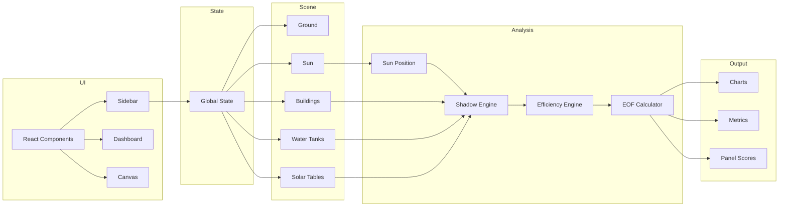
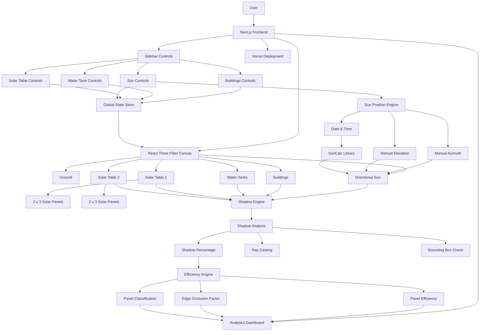

# Solar Shadow Analysis

A web-based 3D solar shadow simulation and efficiency analysis platform built with Next.js, React Three Fiber, and SunCalc.

---

## Project Overview

Solar Shadow Analysis allows users to place buildings, water tanks, and solar panel tables on a virtual site and simulate how shadows from those objects affect solar panel performance throughout the day.

The application computes:
- Real-time shadow percentages per panel using Three.js raycasting
- Panel efficiency scores adjusted for shadow location (Edge Occlusion Factor)
- Dynamic sun positioning using real solar geometry via SunCalc
- A live analytics dashboard displaying per-panel and per-table results

---

## Tech Stack

| Technology | Role |
|---|---|
| **Next.js 16 (App Router)** | Framework and SSR/static generation |
| **React 19** | UI component model |
| **TypeScript** | Strict typing throughout |
| **Three.js** | 3D rendering engine |
| **React Three Fiber** | React bindings for Three.js |
| **@react-three/drei** | Camera controls and helpers |
| **SunCalc 2** | Real solar position calculation |

---

## Project Architecture

```
src/
├── app/
│   ├── page.tsx          # Root page — state orchestration
│   ├── layout.tsx        # App shell and metadata
│   └── globals.css       # Global design system styles
│
├── components/
│   ├── scene/
│   │   ├── MainCanvas.tsx   # Canvas root — shadow analysis loop
│   │   ├── Building.tsx     # Box mesh, tagged as occluder
│   │   ├── WaterTank.tsx    # Cylinder mesh, tagged as occluder
│   │   ├── SolarPanel.tsx   # Panel mesh with shadow status color
│   │   ├── SolarTable.tsx   # 2×3 panel array with structure
│   │   ├── Sun.tsx          # Dynamic directional light + sun sphere
│   │   ├── Lighting.tsx     # Ambient light
│   │   ├── Camera.tsx       # Perspective camera + OrbitControls
│   │   └── Ground.tsx       # Ground plane + grid
│   │
│   └── ui/
│       ├── Sidebar.tsx      # Controls panel (objects + sun + analysis)
│       ├── Dashboard.tsx    # Analytics dashboard overlay
│       └── Controls.tsx     # Reusable form inputs (NumberInput, etc.)
│
├── utils/
│   ├── sunEngine.ts         # SunCalc integration → direction vector
│   ├── shadowEngine.ts      # Raycaster 3×3 grid analysis
│   ├── efficiencyEngine.ts  # Efficiency model + table summaries
│   └── eofEngine.ts         # Edge Occlusion Factor calculation
│
└── types/
    └── index.ts             # Shared TypeScript interfaces
```

### Layer Responsibilities

| Layer | Responsibility |
|---|---|
| **UI Layer** | User controls, sidebar inputs, dashboard display |
| **Scene Layer** | 3D mesh rendering, shadow casting, visual feedback |
| **Analysis Layer** | `useFrame` loop, panel sampling, occluder traversal |
| **Utility Layer** | Pure functions — sun math, raycasting, efficiency |

---

## Shadow Analysis Methodology

### Sampling Grid

Each solar panel is sampled at **9 points** arranged in a 3×3 grid:

```
[ (-W/3, -L/3) ]  [ (0, -L/3) ]  [ (+W/3, -L/3) ]
[ (-W/3,    0) ]  [ (0,    0) ]  [ (+W/3,    0) ]
[ (-W/3, +L/3) ]  [ (0, +L/3) ]  [ (+W/3, +L/3) ]
```

Where W = panel width (1.6m) and L = panel length (1.0m).

Each point is offset **0.08m above the panel surface** in local space before being transformed to world coordinates via the panel's `matrixWorld`.

### Raycasting

For each sample point, a ray is cast toward the **normalized sun direction vector**:

```
raycaster.set(samplePoint, sunDirectionNormalized)
intersections = raycaster.intersectObjects(occluderMeshes)
```

If any intersection is detected, the point is classified as **occluded**.

Occluders are buildings and water tanks (tagged with `userData.role = "occluder"`).

### Shadow Percentage Formula

```
Shadow Percentage = (Occluded Points / 9) × 100
```

| Range | Classification |
|---|---|
| 0–10% | Optimal |
| 10–40% | Partially Shaded |
| 40–100% | Heavily Shaded |

The analysis loop runs every **6 render frames** (~10 analyses/second) to maintain smooth camera performance.

---

## Efficiency Methodology

### Base Efficiency

```
Base Efficiency = 100 − Shadow Percentage
```

This is a simplified linear model. It assumes that each percentage point of shadow reduces output by an equal fraction.

### Final Efficiency

```
Final Efficiency = Base Efficiency × (1 − EOF × 0.15)
```

The constant `0.15` is a penalty weight applied to the EOF. It is tuned to be visible but non-extreme, representing a mild location-dependent degradation.

All efficiency values are clamped to [0, 100].

---

## Edge Occlusion Factor (EOF)

### Motivation

Not all panel positions are equally sensitive to shading. The center cell of a solar panel is electrically more significant than corner cells. A shadow hitting the center disrupts more of the panel's bypass diode circuitry than the same area of shadow at an edge.

### Grid Weights

Each of the 9 sample points is assigned a weight:

```
┌──────┬──────┬──────┐
│ 0.5  │ 0.7  │ 0.5  │   ← corners
├──────┼──────┼──────┤
│ 0.7  │ 1.0  │ 0.7  │   ← edges / center
├──────┼──────┼──────┤
│ 0.5  │ 0.7  │ 0.5  │
└──────┴──────┴──────┘

Total weight sum = 6.8
```

### EOF Formula

```
EOF = Sum of weights of occluded points / 6.8

Range: [0.0, 1.0]
```

A panel with only corner shadows → low EOF → smaller efficiency penalty.
A panel with center shadow → high EOF → larger efficiency penalty.

---

## Assumptions

- **Flat terrain**: All scene objects rest on a flat ground plane at Y = 0.
- **Constant irradiance**: No cloud cover, atmospheric scattering, or weather modelling.
- **Simplified panel model**: Each panel is a single rectangular mesh; internal cell strings and bypass diodes are not modelled.
- **Opaque occluders only**: Buildings and water tanks are treated as fully opaque; reflections from surfaces are ignored.
- **Fixed panel tilt**: All solar tables use a fixed 15° southward tilt; orientation is not configurable.
- **Linear efficiency model**: Efficiency degrades linearly with shadow percentage; real PV degradation is non-linear.

---

## Limitations

- Raycasting does not account for diffuse irradiance (sky radiation). Real panels receive ~15% of their energy from diffuse light even when directly shaded.
- The efficiency model is a simplified approximation and is not calibrated to a specific panel technology (mono/polycrystalline, thin-film, etc.).
- No atmospheric refraction or sunset/sunrise rounding effects.
- Scene is not geographically positioned — sun calculations use a generic mid-latitude default location.
- No seasonal performance integration or energy yield (kWh) estimation.
- Performance degrades at very high panel counts due to per-frame raycasting.

---

## Installation

```bash
# Install dependencies
npm install

# Start development server
npm run dev

# Build for production
npm run build

# Start production server
npm start
```

Open [http://localhost:3000](http://localhost:3000) in your browser.

---

## Usage

1. **Add objects**: Use the sidebar to adjust positions and dimensions of buildings, water tanks, and solar tables.
2. **Set sun position**: Use Manual mode (azimuth + elevation sliders) or Automatic mode (date + time inputs).
3. **View shadow analysis**: Panel colors update in real time — green (optimal), yellow (partial shade), red (heavily shaded).
4. **Open dashboard**: Click "Dashboard" to see per-panel shadow percentages, efficiency scores, and EOF values.
5. **Experiment**: Move buildings closer to solar tables to see shadow percentages increase.

---

## Folder Structure

```
solar-panel/
├── src/
│   ├── app/             # Next.js App Router pages and global CSS
│   ├── components/
│   │   ├── scene/       # Three.js / R3F 3D scene components
│   │   └── ui/          # Sidebar, Dashboard, and form controls
│   ├── utils/           # Pure analysis utilities
│   └── types/           # Shared TypeScript interfaces
├── public/              # Static assets
├── package.json
├── tsconfig.json
└── next.config.ts
```

---

## Data Flow Diagram



---

## System Architecture



---

## Component Hierarchy

```
App
│
├── Layout
│
├── Sidebar
│   ├── SunControls
│   ├── BuildingControls
│   ├── WaterTankControls
│   ├── SolarTableControls
│   └── ShadowAnalysisSummary
│
├── Canvas
│   ├── Camera
│   ├── OrbitControls
│   ├── Ground
│   ├── Buildings
│   ├── WaterTanks
│   ├── SolarTable 1
│   │   ├── Panel 1
│   │   ├── Panel 2
│   │   ├── Panel 3
│   │   ├── Panel 4
│   │   ├── Panel 5
│   │   └── Panel 6
│   │
│   ├── SolarTable 2
│   │   ├── Panel 1
│   │   ├── Panel 2
│   │   ├── Panel 3
│   │   ├── Panel 4
│   │   ├── Panel 5
│   │   └── Panel 6
│   │
│   └── Sun (DirectionalLight + helper sphere)
│
├── ShadowEngine       ← utils/shadowEngine.ts
│
├── EfficiencyEngine   ← utils/efficiencyEngine.ts
│
├── EOFCalculator      ← utils/eofEngine.ts
│
└── Dashboard
    ├── Global Summary (avg efficiency, avg shadow, total/shaded panels)
    ├── Per-Table Metrics (avg shadow %, avg efficiency, best/worst panel)
    ├── Per-Panel Data Table (ID, shadow %, efficiency %, EOF, status)
    └── Panel Status Grid (green / yellow / red cells)
```
